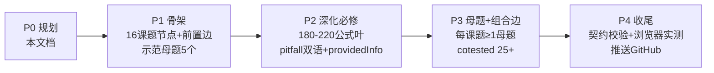

# DSE 化学全景知识图谱 · 规划文档

> 版本：v0.1（规划稿）
> 依据：HKDSE Chemistry C&A Guide（2022 新大纲）+ 历年真题 + 补习社交叉验证
> 范围：必修 12 单元 + 选修 3 单元（选 2）+ SBA 实验技能

---

## 1. 愿景与目标

与数学、物理图谱一致：把 DSE 化学**最值钱但最看不见的「知识关系」画成可放缩的全景地图**，让一个没学过 DSE 化学的学生：
- 打开就能看到全科地图（12 必修 + 3 选修 + 实验）
- 知道「学完 A 才能学 B」的学习顺序
- 知道每个课题「考什么、占多少、怎么考」
- 点开任何知识点都有公式/反应 + 陷阱 + 母题

### 化学特有的「希望时刻」
1. **化学反应是链不是点**：化学知识天然是「A + B → C」的反应链（如：石灰石 → 生石灰 → 熟石灰 → 水泥）。图谱必须画出「制备流程/转化链」，这是化学独有的价值。
2. **Distinguish 题（鉴别题）每年必出且跨课题**：学生要能一眼看出「用哪种试剂区分这几种物质」。图谱的 cotested 边正好支撑这个能力。
3. **实验题占比极高**：SBA 20% + 卷一大量实验题。图谱要有独立的实验技能分支，且每个课题标注常考实验。

---

## 2. 官方框架（内容边界铁律）

本图谱完全依据 DSE 化学考试本身：知识范围 = 2022 新大纲 C&A Guide + 历年真题。**不超纲、不引入大学内容、不凭经验臆造。**

### 2.1 考试结构

| 部分 | 占比 | 内容 |
|------|------|------|
| 卷一 | 60% | 必修 12 单元（甲部 MC 30% + 乙部 LQ 30%） |
| 卷二 | 20% | 选修 3 选 2（每单元 1 题，约 20 分/题） |
| SBA | 20% | 校本评核（≥1 次容量分析 + ≥1 次定性/其他实验） |

### 2.2 必修 12 单元（Topic 1-12）

| # | 单元 | 中名 | 年级(约) | 重要性 |
|---|------|------|---------|--------|
| 1 | Planet Earth | 地球 | S4 | 低（基础） |
| 2 | Microscopic World I | 微观世界 I | S4 | 中（基础） |
| 3 | Metals | 金属 | S4 | 中高 |
| 4 | Acids and Bases | 酸和盐基 | S4 | **高（核心）** |
| 5 | Fossil Fuels and Carbon Compounds | 化石燃料和碳化合物 | S4-S5 | 中高 |
| 6 | Microscopic World II | 微观世界 II | S5 | **高（键合/结构）** |
| 7 | Redox Reactions, Chemical Cells and Electrolysis | 氧化还原、化学电池和电解 | S5 | **高（核心）** |
| 8 | Chemical Reactions and Energy | 化学反应和能量 | S5 | 中高 |
| 9 | Rate of Reaction | 反应速率 | S5-S6 | **高** |
| 10 | Chemical Equilibrium | 化学平衡 | S6 | **高（核心）** |
| 11 | Chemistry of Carbon Compounds | 碳化合物的化学 | S6 | **高（核心）** |
| 12 | Patterns in the Chemical World | 化学世界的规律 | S6 | 中 |

### 2.3 选修 3 单元（Topic 13-15，考生选 2 个）

| # | 单元 | 中名 | 选考率 | 特点 |
|---|------|------|--------|------|
| 13 | Industrial Chemistry | 工业化学 | ~97% 考生选（学校教） | 与电解/速率/平衡强关联 |
| 14 | Materials Chemistry | 材料化学 | 少人选 | 题变少、生活化、数学要求低、可轻松 80% |
| 15 | Analytical Chemistry | 分析化学 | ~97% 考生选（学校教） | 内容最丰富；滴定/光谱/质谱 |

### 2.4 2022 新大纲关键变化（必须遵守）

- ⚠️ **Le Chatelier's Principle 已被淘汰**——平衡移动的题目改为用「反应商 Q vs Kc」解释，不能再用勒沙特列原理作答
- 删除/缩减了不少范围（具体以 C&A Guide 为准）
- 新增大量「教科书没见过」的实验题，考查临场理解实验的能力

---

## 3. 母题体系

沿用数学/物理六要素（题干 + 主角/配角 + 解法骨架 + 变式方向 + 出现记录），但化学母题按题型细分 `questionType`：

| 题型 | 说明 | 示例 |
|------|------|------|
| **distinguish** | 鉴别题，每年必出，跨课题 | 用试剂区分 NaCl / Na₂CO₃ / Na₂SO₄ |
| **titration** | 滴定计算题 | 酸碱滴定求浓度、返滴定 |
| **preparation** | 制备流程题 | 工业制硫酸、从铝土矿制铝 |
| **energy** | 能量计算题 | Hess 定律、ΔH 计算、键能 |
| **rate-equilibrium** | 速率与平衡题 | 反应商 Q vs Kc 判断移动 |
| **organic** | 有机推断题 | 同分异构、官能团转化 |
| **experiment** | 实验设计/评估题 | SBA 常用；变量控制、误差分析 |
| **data-analysis** | 数据分析题 | 读图表、光谱/质谱解析 |

**质量门槛**（沿用手册）：没有变式方向的不进母题库。

---

## 4. 数据模型

### 4.1 节点层级（三层）
- **范畴（domain）**：化学不用数学的「3 范畴」也不像物理的「5 课题」，而是 **6 大分组**（见 4.3）
- **课题（topic）**：12 必修 + 3 选修 + 1 SBA = **16 个课题节点**
- **公式叶（leaf）**：目标 180-220 个，类型见 4.2

### 4.2 knowledgeType（化学定制）

| 类型 | 说明 | 示例 | 视觉色 |
|------|------|------|--------|
| **concept** | 概念 | 摩尔、浓度、同分异构 | 蓝 |
| **equation** | 化学方程式 | 2H₂ + O₂ → 2H₂O | 绿 |
| **reaction** | 反应类型/机理 | 加聚、酯化、中和 | 琥珀 |
| **law** | 定律/原理 | Hess 定律、阿伏伽德罗定律 | 紫 |
| **lab** | 实验技能/操作 | 滴定操作、焰色试验 | 青 |

### 4.3 范畴分组（6 组）

| 组 | 涵盖课题 | 分组依据 |
|----|---------|---------|
| **物质与结构** | 地球、微观世界 I、微观世界 II | 物质的组成与结构 |
| **元素与转化** | 金属、酸碱、化石燃料 | 元素性质与无机转化 |
| **反应与能量** | 氧化还原/电解、反应能量、反应速率、化学平衡 | 反应动力学与热力学 |
| **碳化学** | 碳化合物的化学 | 有机化学 |
| **规律** | 化学世界的规律 | 周期律与元素周期表 |
| **选修+实验** | 工业/材料/分析 + SBA | 选修与实验 |

### 4.4 考试资料标注（`providedInfo`，化学特色）

化学考试会提供资料，学生要知道「考场有什么可以抄」：
- **Periodic Table**（周期表）—— 考试提供
- **Standard Electrode Potentials**（标准电极电位表）—— 考试提供
- **离子鉴别表/常见气体检验** —— 需记忆，不提供

叶子标注 `providedInfo: 'periodic-table' | 'electrode-potentials' | null`，让学生区分「要背」vs「考场有得查」。

### 4.5 关系边（四类，与数学/物理一致）
- **prereq 前置**：如「微观世界 I → 微观世界 II」「平衡 → 工业化学（选修）」
- **derives 推导**：如「Hess 定律 ← 能量守恒」
- **related 相关**：如「金属 ↔ 氧化还原」
- **cotested 组合出题**：如「酸碱 ⇄ 滴定（选修分析）」「电解 ⇄ 工业化学」

### 4.6 母题实体
沿用六要素结构（与数学/物理契约一致：`stem` + `stemEn` + `solutionSkeleton[]` + `variation[]` + `appearances[]` + `questionType`）。

---

## 5. 交互设计

**完全复用数学/物理渲染器**（零依赖单文件 HTML），伪立体四机制不变：
- 分层下钻（范畴 → 课题 → 公式叶）
- 边类型开关
- 焦点辐射（点开看星形关联）
- 题群引力（经常一起考的吸在一起）

新增化学特色：
- **反应链视图**：勾选「反应链」模式，高亮推导边，显示「原料 → 中间体 → 产物」的转化链
- **providedInfo 标注**：叶子详情显示「考场提供：周期表」等
- 双语（中/英）、年级过滤、模块过滤（必修/选修/SBA）

---

## 6. 技术选型

- 零依赖单文件 HTML（`dse-chemistry-map.html`）+ 数据分离（`graph-data.js`）
- 复用数学/物理渲染器（已增强 renderFormula，支持化学方程式）
- **契约校验**：`contract-check.js` 必须全绿（domains/knowledgeTypes/edgeTypes/母题六要素/叶子 pitfall 双语）
- 数据是核心资产，网页只是视图（同数学/物理）

---

## 7. 分期计划

---

## 8. 质量与风险

| 风险 | 应对 |
|------|------|
| **新大纲知识过时**（如 Le Chatelier 淘汰） | 所有内容严格按 2022 新大纲；反应商 Q vs Kc 作为平衡移动的唯一解释框架 |
| **化学方程式书写错误**（配平/状态符号） | 每个 equation 叶子逐个校对配平 + (s)/(l)/(g)/(aq) 状态 |
| **有机化学命名/官能团混淆** | 有机叶子按同系列（alkane/alkene/alkanol/alkanoic acid）体系化 |
| **实验题占比高但难标准化** | 独立 SBA 分支 + 每个课题标注「常考实验」叶子；母题 questionType=experiment 覆盖 |
| **选修选考率差异大** | 三个选修都建，但标注选考率（工业/分析 ~97%，材料少人但好拿分） |
| **契约不匹配（重蹈物理覆辙）** | 数据建好先跑 contract-check.js，再碰渲染器 |

---

## 9. 数据来源

- **官方**：HKEAA C&A Guide（2022 新大纲）、历年真题
- **补习社**：iLab（三大核心课题）、staralchemy（必修/选修结构 + 选考率）、AfterSchool（操卷/结构）、Exampro Sam Chai（课题难度/考点）、TutorCircle（distinguish 题型）
- **by-topic 真题**：passpaper-unstoppable（dse.life 镜像，完整中英 by topic）、dse247 化学版、AfterSchool、HKCEE(1978-2011) + HKALE 历史
