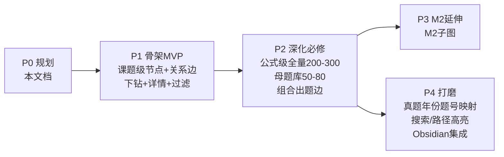

# DSE 数学知识图谱 · 规划文档

> 状态：待审阅（先对齐方向，再动工）
> 日期：2026-08-18
> 定位：本文档是项目的顶层设计。确认后，一切实施以本文档为准。

---

## 0. 工作区现状说明（诚实交代）

在「先规划后动手」之前，上一轮会话已经产出了一个 **P1 可行性原型**，落盘于 `knowledge-map/`：

| 文件 | 状态 | 用途 |
|------|------|------|
| `graph-data.js` | 已有雏形 | 38 课题节点（必修 26 + M2 12）、46 条关系边、64 个公式级叶子 |
| `dse-math-map.html` | 已有雏形 | 零依赖单文件渲染器（力导向 + 下钻 + 双语 + 过滤） |
| `test-cdp.mjs` | 调试脚本 | 浏览器实测用（可删） |

**结论**：原型证明了「数据层 + 渲染层分离」这条技术路线走得通，但它不是正式产品——**数据结构里还没纳入「母题」这一核心实体**，而这是本文档要补上的关键设计。正式开工时，数据骨架会按本文档重新对齐（尤其加入母题层）。现有雏形恰好已是「必修 26 + M2 12」，与本次定稿的「必修 + M2」范围一致。

---

## 1. 愿景与目标

**一句话愿景**：做一张严格依据 DSE 数学考试本身（必修 Compulsory Part + 延伸 M2）的「可下钻全景地图」，让学习者在中四之前，就能抽象地看见整个考试的骨架——知识从哪来、和谁捆绑、最终考成什么题。

**要解决的三个真问题**：

1. **全景感缺失**：现行教材按年级/章节线性推进，学生看不到「我现在学的是全景图的哪一块」，容易只见树木不见森林。
2. **抽象提前**：大陆高考已有成熟知识图谱产品，DSE 一侧只有「专题清单」（SketchMath 等），没有真正的网状关联——本图谱填补这个空缺。
3. **题型思维**：DSE 卷一题型高度稳定，学生最缺的不是单个公式，而是「母题」——一类题的原型。掌握了母题，就能识别所有变式。

### 1.1 高中生视角：五个价值时刻

规划不该只讲「节点 / 边 / 数据模型」，更要回答「一个正在备考的人，会在哪一刻觉得有它真好」：

1. **考前扫全景**：拉远看三大范畴、三十个课题全在图里——「我全都在图里，没有漏掉的窟窿」的踏实感，与「背了一堆公式但不知道全不全」是两种心态。
2. **母题当题眼**：点开「判别式」直接看到它的母题，刷到同类题 10 秒认出「这是那个母题的变式」，而不是当新题硬啃。
3. **看见通往哪里**：中四学二次方程时，图谱告诉它以后要和中五的圆、M2 的微积分怎么接上——解决「我学这个到底有什么用」。
4. **练卷二速度（题型雷达）**：卷二平均 100 秒/题，高手赢在「一眼认出这是哪几个知识点的组合」。图谱的母题 + 组合边，可用来练「题感」——先别算，先判断组合。
5. **会长大的资产**：DSE 卷一稳定，每年新真题只是往母题库加「新变式」、往图上加「新的组合边」。今年用，明年更值钱。

---

## 2. DSE 数学官方框架梳理

> **内容边界铁律**
> 本图谱完全依据 DSE 数学考试本身：知识范围 = 官方 C&A Guide 划定 + 历年真题实际考查。不超出考试范围、不引入大学内容、不凭经验臆造。教材章节仅用于对齐「按年级显示」，不作为知识范围的依据。
>
> **范围：必修 Compulsory Part + 延伸 M2（代数与微积分），不含 M1。**

### 2.1 考核结构（HKEAA）

| 部分 | 内容 | 权重 | 题型 |
|------|------|------|------|
| 必修 Compulsory Part | 全体考生 | 试卷总分主体 | 卷一：传统题（长题目，步骤计分）；卷二：选择题（MC） |
| 延伸 Extended Part | 本项目只做 M2 | M2（代数与微积分），不含 M1 | 卷三 |

### 2.2 必修部分三大范畴与学习单元（C&A Guide 约定，稳定公开）

**① 数与代数（Number and Algebra）**
- 数的概念、百分率、比/比例/变分
- 多项式运算
- 方程与不等式（一元二次、判别式 Δ）
- 等差数列与等比数列（AS & GS）
- 指数与对数函数
- 函数与图像
- 线性规划

**② 度量、图形与空间（Measures, Shape and Space）**
- 求积法（面积/体积）
- 平面几何（角、三角形、多边形）
- 圆的基本性质（弦、切线、割线）
- 坐标几何（直线方程、距离、中点）
- 三角学（正弦/余弦定理、解三角形）
- 三维空间问题
- 向量
- 几何变换（平移/反射/旋转/放大缩小）

**③ 数据处理（Data Handling）**
- 数据的组织与表述
- 集中趋势与离散度量（平均数/中位数/众数/标准差）
- 概率（古典概型）
- 排列与组合（nPr / nCr）
- 条件概率与独立事件

### 2.3 延伸部分（本项目只做 M2）

- **M2 代数与微积分**：数学归纳法、二项式定理、三角函数的微积分、极限、导数、积分、矩阵、向量、圆锥曲线
- 选 M2 的原因：与必修的三角学、多项式、函数链强关联，图谱叙事自然衔接；M1（微积分与统计）不纳入。

### 2.4 关键洞察：为什么 DSE 特别适合做图谱

1. **课程封闭**：范围由官方 C&A Guide 锁定（30+ 学习单元），不像开放领域知识会失控。
2. **题型稳定**：卷一每年题型高度重复，「母题 → 变式」的映射比高考更容易做准。
3. **组合出题明显**：DSE 长题目极爱「跨知识点捆绑」（如圆 + 判别式、数列 + 对数），这正是图谱关系边的天然素材。

---

## 3. 母题体系（核心设计）

> 「母题」是大陆应试教育的成熟概念，本项目把它移植到 DSE 语境并落地为数据结构。

### 3.1 什么是「母题」

**大陆定义**：一个知识模块下，能「一题带一类」的原型题——掌握了母题的解法，就能识别并解决它的一切变式（换数字、换包装、换组合）。

**DSE 落地定义**：母题 = 某知识点（或知识点组合）的**最小可复用解题原型**。

### 3.2 母题示例（三类，先验证概念）

| 母题 | 主角知识点 | 组合知识点 | 变式方向 |
|------|-----------|-----------|----------|
| 「抛物线与 x 轴交点个数，求参数范围」 | 判别式 Δ | 二次函数图像 | 换「有实根」「相切」「无交点」三种表述 |
| 「圆内弦长 + 切线与割线」 | 圆的基本性质 | 判别式 Δ、二次方程 | 圆 + 直线相交求弦长、切点坐标 |
| 「已知首项/公差，求第 n 项与前 n 项和」 | 等差数列 | 等比数列、对数 | 换等比、混合 AS+GS、给 Sn 反推通项 |

### 3.3 母题的六要素（数据结构）

```json
{
  "id": "mt-discriminant-intersect",
  "titleZh": "抛物线与 x 轴交点个数求参数范围",
  "titleEn": "Number of x-intercepts of a parabola",
  "coreTopics": ["quadratic-equation", "discriminant"],   // 主角知识点
  "relatedTopics": ["quadratic-function"],                 // 配角知识点
  "stem": "若 y = x² + kx + 4 的图像与 x 轴没有交点，求 k 的范围。",
  "solutionSkeleton": ["列 Δ = b²−4ac", "代入 Δ < 0", "解不等式求 k 范围"],
  "variation": ["有实根→Δ≥0", "相切→Δ=0", "两个交点→Δ>0"],
  "appearances": [{ "year": 2019, "paper": 1, "q": "LQ", "weight": "high" }]
}
```

### 3.4 母题与图谱的关系

- **母题是「边」的具象化**：图谱里的 `co-tested` 边（组合出题）背后，往往就是一个母题在支撑。
- **详情面板的「母题区」**分两栏：
  - 「作为主角」：这个知识点是解题核心的母题；
  - 「作为配角」：这个知识点被捆绑进别的母题的组合。
- **母题是学习者视角的终点**：知识点（是什么）→ 关系（从哪来、和谁搭）→ 母题（最终考成什么题）。

### 3.5 母题库构建策略

1. **来源**：历年 DSE 卷一真题（HKEAA 公开试卷 + 评分标准）。
2. **提取原则**：一题只归入一个「最小原型」，多个原型共存时拆解记录。
3. **规模目标**：必修 50–80 个母题（卷一题型稳定，这个量级已能覆盖主干）。
4. **质量门槛**：每个母题必须能标注「变式方向」，否则说明它还不是「母题」而是「孤题」。

---

## 4. 数据模型设计

### 4.1 三层节点（Node）

| 层级 | 说明 | 数量级 |
|------|------|--------|
| `domain` | 范畴（必修 3 个 + M2 1 个） | 4 |
| `topic` | 课题/学习单元 | ~35（必修）+ 18（M2） |
| `leaf` | 公式级叶子（基础公式） | 200–300 |

### 4.2 节点属性

```json
{
  "id": "quad-discriminant",
  "name": "判别式",
  "nameEn": "Discriminant",
  "formula": "\\Delta = b^2 - 4ac",
  "level": "leaf",
  "knowledgeType": "formula",    // formula 公式 | theorem 公理·定理 | corollary 推论/衍生公式
  "domain": "number-algebra",
  "grades": ["S4"],              // 中四/中五/中六
  "difficulty": 2,               // 1–3
  "examWeight": "high",          // 卷一+卷二高频
  "pitfalls": ["漏讨论 Δ=0", "「有实根」漏等号"],
  "parentTopics": ["一元二次方程"]
}
```

### 4.3 关系边（Edge）——四类

| 类型 | 语义 | 线型 | 示例 |
|------|------|------|------|
| `prerequisite` | 前置：学它之前必须会什么 | 实线箭头 | 二次方程 → 判别式 |
| `derives` | 推导：它从哪来 | 虚线箭头 | 求根公式 → 判别式 |
| `related` | 相关：同域内的弱关联 | 点线 | 余弦定理 ↔ 勾股定理 |
| `co-tested` | 组合出题：常捆绑出题 | 双线（加粗） | 圆 ↔ 判别式 |

> 颜色已从「范畴」让位给「知识类型」，边只用线型区分（见 5.1 视觉编码表）。

### 4.4 母题实体（Mother Problem）

见第 3 节，是独立的一等公民实体，通过 `coreTopics` / `relatedTopics` 与节点双向关联。

### 4.5 真题映射（P4 引入，不在首期）

```json
{ "year": 2019, "paper": 1, "question": 14, "topics": ["circle", "discriminant"], "motherProblem": "mt-circle-chord" }
```

---

## 5. 产品交互设计

### 5.1 主视图：分层力导向图（伪立体）

**核心决策**：不做字面 3D（手机拖拽 + 遮挡体验差），用「结构感」兑现「立体感」。四个机制：

1. **分层下钻（深度）**：默认显示课题级（~35 节点）一眼看全景，点击范畴/课题逐层下钻到公式叶子。深度感来自「钻进去」，不是「转起来」。
2. **边类型开关（稀疏）**：四种边默认不全显示——全景只亮「前置」（骨架线），「组合出题」这种最密、最值钱的边，**选中某节点时才亮起**。图永远稀疏，信息却全在。
3. **焦点辐射（星形图，核心）**：点开一个知识点，视图从「全景」切换成「以它为中心」，只显示它的前置 / 推导 / 相关 / 组合伙伴。**每个知识点都是枢纽，图围绕当前关注点「长」出来**——这是「拓展感」的核心来源。
4. **题群引力（抱团）**：力导向图里「组合出题频率」作为弹簧强度，常一起考的知识点吸到一起抱成团，形成「题群岛屿」——岛内强相关，岛间稀疏桥接。结构感不是高度，是引力长出来的形状。

**视觉编码表**（颜色从「范畴」让位给「知识类型」）：

| 视觉通道 | 编码内容 |
|---------|---------|
| 颜色（色相） | 知识类型：**公式 / 公理·定理 / 推论（衍生公式）** |
| 形状 | 节点层级：范畴（大圆）/ 课题（中圆）/ 叶子（小圆） |
| 大小 | 考试权重 / 出现频率 |
| 边线型 | 关系类型：前置（实线箭头）/ 推导（虚线）/ 相关（点线）/ 组合出题（双线加粗） |
| 位置抱团 | 范畴分区 + 题群引力 |

**知识类型三色（教学价值）**：

| 类型 | 学习任务 | 示例 | 颜色 |
|------|---------|------|------|
| 公式 formula | 要背 + 会套 | Δ=b²−4ac、正弦定理、∫xⁿdx | 一类色 |
| 公理·定理 theorem | 要理解成立条件 + 会证 | 圆的切线性质、中值定理 | 二类色 |
| 推论/衍生公式 corollary | 要**认得出**，常是题的隐藏桥梁 | 两直线垂直 ⇔ 斜率积 = −1 | 三类色 |

> 知识类型标签主要落在公式叶子层；课题层是复合的，不单一归类。「推论」类对应「推导」边，是把定理和公式连起来的桥。

### 5.2 节点详情面板

点开任一知识点，四区：
1. **本体**：定义、基础公式（KaTeX 渲染，中英双语）
2. **难点 & 常考点**：易错点清单 + 卷一/卷二频率标注
3. **母题区**：作为主角的母题 + 作为配角的组合母题
4. **关联**：前置 / 推导 / 相关 / 组合出题 四类邻居

### 5.3 过滤器

- **年级**（中四/中五/中六）：勾选后子图重新布局，直观看到「这一年我在全景图的哪一块」。
- **范畴**（三大范畴）
- **考试权重**（高频/中频/低频）
- **模块**（必修 / M2 / 全部）

### 5.4 双语切换

全局中 / EN 一键切换（名称、公式、题干均双语，DSE 考生习惯英文答题）。

### 5.5 搜索与路径高亮

- 搜索知识点名/公式关键字，定位节点并高亮。
- 「路径模式」：选两个知识点，高亮它们之间最短的前置/推导链。

---

## 6. 技术选型

| 决策 | 选择 | 理由 |
|------|------|------|
| 渲染 | 零依赖单文件 HTML + SVG 手写力导向 | 本地双击即用，无需联网、无需构建 |
| 数据层 | `graph-data.js`（JSON 结构）与渲染层分离 | 数据是复用资产，可喂 Anki / Obsidian / 印刷版 |
| 公式 | KaTeX（CDN 或内嵌） | DSE 公式密集，需专业渲染 |
| 交互 | 原生 JS（无框架） | 单文件、零依赖、易维护 |
| 未来集成 | Obsidian 原生 graph + 印刷版全景图 | 数据层分离后，多个视图只是「多一个渲染器」 |

**数据是本项目的核心资产，网页只是它的一个视图。**

---

## 7. 分期实施计划



| 阶段 | 交付物 | 验收标准 | 工作量 |
|------|--------|----------|--------|
| **P0 规划** | 本文档 | 方向确认 | 已完成 |
| **P1 骨架 MVP** | 课题级图谱 + 交互跑通 | 浏览器里能转、能下钻、能过滤、无 JS 报错 | 1 次会话 |
| **P2 深化必修** | 公式级全量 + 母题库 50–80 | 每范畴公式经校对、每个母题有变式方向 | 数据大活，分范畴推进 |
| **P3 M2 延伸** | M2 子图 | 与必修三角/多项式/函数链自然衔接 | 视 P2 体感再定 |
| **P4 打磨** | 真题映射 + 路径高亮 + Obsidian 集成 | 可按年份/题号反查知识点 | 视体感再定 |

---

## 8. 质量与风险

### 8.1 最大风险：公式准确性

这是知识图谱的**生命线**，一个错公式会毁掉整张图的信任。对策：
- 逐范畴校对（数与代数 → 度量图形 → 数据处理），每次只过一个范畴，不一把梭。
- 公式标注来源（C&A Guide / 教材），可疑处标记待核。

### 8.2 数据来源

- **官方（唯一知识范围依据）**：EDB/HKEAA 的 C&A Guide、历年试卷与评分标准。
- **教材（仅对齐年级划分）**：中四/中五/中六主流教材的章节结构，用于「按年级显示」，不作为知识范围依据。

### 8.3 规模控制

- 分层展开而非一次性渲染，避免 300 节点糊脸。
- 母题宁缺毋滥：不能标注变式方向的，不进母题库。

---

*本规划文档确认后，即作为唯一实施依据；P1 数据骨架将按第 3、4 节重构（纳入母题实体）。*
