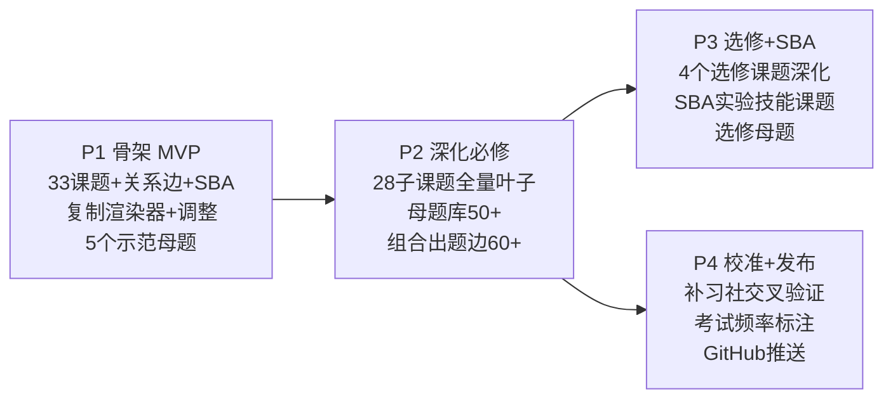

# DSE 物理知识图谱规划文档

> 2026-08-20。基于数学图谱 v0.2.0 的生产线复用。

---

## 0. 与数学图谱的差异

| 维度 | 数学 | 物理 |
|------|------|------|
| 范畴 | 3 大范畴（NA/MS/DP） | 5 大课题（本身就是范畴） |
| 选修 | M2 一个 | 4 个（四选二，卷二考核） |
| SBA | 无 | 占 20%，需覆盖实验技能 |
| 公式来源 | 全部要背 | Data Sheet 提供部分，需区分 |
| 特有题型 | — | 解释题（因果链）、图像题（v-t/s-t/I-V）、实验设计/评估 |
| 考核结构 | 卷一 65% + 卷二 35% | 卷一 60% + 卷二 20% + SBA 20% |

**渲染器调整**：
- 范畴从 3 个改为 5 个必修 + 1 个选修区 + 1 个 SBA 区
- 模块切换从「必修/M2」改为「必修/选修/SBA」
- 叶子新增 `dataSheet` 布尔字段（标注该公式是否在 Data Sheet 中提供）

---

## 1. 课题结构（基于 C&A Guide + passpaper-unstoppable 索引）

### 必修（28 个子课题，卷一 60%）

**I. 热和气体 Heat and Gases**（Book 1，约 12-18 分/年）

| ID | 子课题 | 英文 |
|----|--------|------|
| ph-01 | 温度、热和内能 | Temperature, Heat and Internal Energy |
| ph-02 | 热传递过程 | Transfer Processes |
| ph-03 | 物态变化 | Change of State |
| ph-04 | 通用气体定律 | General Gas Law |
| ph-05 | 气体动理论 | Kinetic Theory |

**II. 力和运动 Force and Motion**（Book 2，约 25-35 分/年，**最重**）

| ID | 子课题 | 英文 |
|----|--------|------|
| ph-06 | 位置与运动 | Position and Movement |
| ph-07 | 牛顿定律 | Newton's Laws |
| ph-08 | 力矩 | Moment of Force |
| ph-09 | 功、能量和功率 | Work, Energy and Power |
| ph-10 | 动量 | Momentum |
| ph-11 | 抛体运动 | Projectile Motion |
| ph-12 | 圆周运动 | Circular Motion |
| ph-13 | 万有引力 | Gravitation |

**III. 波动 Wave Motion**（Book 3，约 18-25 分/年）

| ID | 子课题 | 英文 |
|----|--------|------|
| ph-14 | 波的传播 | Wave Propagation |
| ph-15 | 波的现象 | Wave Phenomena |
| ph-16 | 光的反射和折射 | Reflection and Refraction of Light |
| ph-17 | 透镜 | Lenses |
| ph-18 | 光的波动性 | Wave Nature of Light |
| ph-19 | 声 | Sound |

**IV. 电和磁 Electricity and Magnetism**（Book 4，约 22-30 分/年）

| ID | 子课题 | 英文 |
|----|--------|------|
| ph-20 | 静电学 | Electrostatics |
| ph-21 | 电路 | Electric Circuits |
| ph-22 | 家居用电 | Domestic Electricity |
| ph-23 | 磁场 | Magnetic Field |
| ph-24 | 电磁感应 | Electromagnetic Induction |
| ph-25 | 交流电 | Alternating Current |

**V. 放射现象与核能 Radioactivity and Nuclear Energy**（Book 5，约 8-14 分/年）

| ID | 子课题 | 英文 |
|----|--------|------|
| ph-26 | 辐射和放射性 | Radiation and Radioactivity |
| ph-27 | 原子模型 | Atomic Model |
| ph-28 | 核能 | Nuclear Energy |

### 选修（4 个，四选二，卷二 20%）

| ID | 课题 | 英文 | 备注 |
|----|------|------|------|
| ph-e1 | 天文学及太空科学 | Astronomy and Space Science | 尖子选择，H-R 图是难点 |
| ph-e2 | 原子世界 | Atomic World | **最热门**，与必修V高度连贯 |
| ph-e3 | 能量和能量的使用 | Energy and Use of Energy | 计算实用，入手快 |
| ph-e4 | 医学物理学 | Medical Physics | 独立公式多，需细读情境 |

### SBA 实验技能

| ID | 课题 | 覆盖内容 |
|----|------|----------|
| ph-sba | 校本评核 | 变量识别与控制、误差分析（随机/系统）、仪器使用、数据处理、实验设计/评估、图解法（斜率/截距） |

---

## 2. 关键跨课题组合（来自 TutorLink/dseapp 交叉验证）

- **能量守恒是全卷最常考的原理**——过山车、跳伞者、充电电容器、衰变核，本质都是同一道能量会计题
- **力和运动** 是热和气体的基础（分子运动论）、波动的基础（横波能量）、电的基础（电子漂移、电动势做功）
- **原子世界（选修）** 与必修V放射核能高度连贯，概念直接延伸
- **卷一乙部出题三种模式**：计算+解释、图像+斜率、设计/评估

---

## 3. 数据模型调整

### 3.1 叶子新增字段

```json
{
  "dataSheet": true,        // 该公式是否在 Data Sheet 中提供
  "formulaType": "suvat"   // 公式分类标签（suvat/气体定律/电磁/光学等），用于快速定位
}
```

### 3.2 母题新增题型标签

```json
{
  "questionType": "calc+explain"  // calc / explain / graph / design / mixed
}
```

### 3.3 其余结构

与数学图谱完全一致：三层节点（范畴/课题/叶子）、四类边、母题六要素、knowledgeType、pitfall、examFrequency、examSection。

---

## 4. 分期计划



---

*待用户确认后开工。*